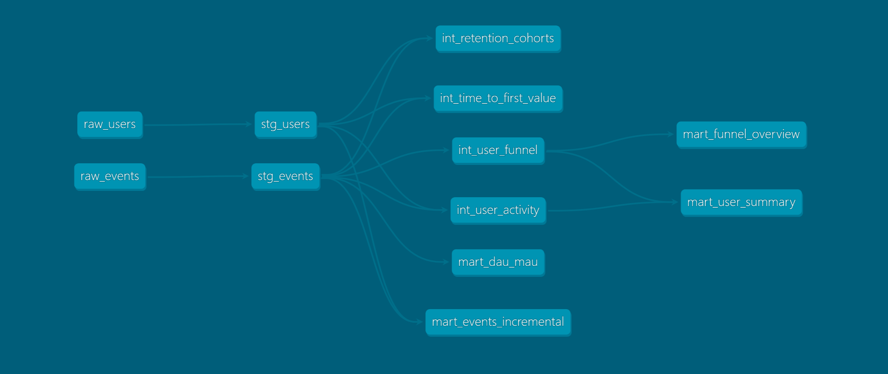

# Canva Analytics — dbt Engineering Project

An analytics engineering project simulating a SaaS product analytics pipeline,
built with dbt and DuckDB. Inspired by the data challenges faced by product 
analytics teams at companies like Canva.

## Project Overview

This project models user behavior data across a full analytics pipeline:
raw event data → cleaned staging models → business logic → analytics-ready marts.

## Data Pipeline (DAG)



## Tech Stack

- **dbt-core** 1.11 — data transformation and modelling
- **DuckDB** — local analytical database
- **Python** — synthetic data generation

## Project Structure

models/

├── staging/          # Raw data cleaning and standardization

│   ├── stg_users     # 1,000 users with plan and country data

│   └── stg_events    # 6,967 user events (designs, exports, invites)

├── intermediate/     # Business logic layer

│   ├── int_user_activity         # Per-user event aggregations

│   ├── int_user_funnel           # Funnel stage classification

│   ├── int_retention_cohorts     # Monthly retention cohort analysis

│   └── int_time_to_first_value   # Days from signup to first design

└── marts/            # Analytics-ready tables for stakeholders

├── mart_user_summary         # Full user profile with engagement tier

├── mart_funnel_overview      # Funnel conversion rates

├── mart_dau_mau              # Daily and monthly active users

└── mart_events_incremental   # Incremental event processing

## Key Metrics Modelled

- **Retention cohorts** - % of users returning each month after signup
- **DAU/MAU ratio** - daily engagement as a share of monthly active users
- **Funnel conversion** - signup → design → export → invite → upgrade
- **Time to first value** - days from signup to first design created
- **Engagement tiers** - inactive / low / medium / high (via reusable macro)

## Data Quality

13 automated tests across all staging models:
- `unique` and `not_null` on all primary keys
- `accepted_values` on plan types and event types
- `relationships` integrity between events and users

## How to Run

```bash
# Install dependencies
pip install dbt-duckdb

# Generate synthetic data
python generate_data.py

# Run full pipeline
dbt seed && dbt run && dbt test
```

## Modelling Decisions

**Why three layers?**
Staging keeps raw data untouched. Intermediate holds business logic separately
from presentation. Marts expose clean, stable interfaces to stakeholders.
Changing a business rule only requires updating one intermediate model.

**Why incremental materialization for events?**
In production, event tables grow continuously. Rebuilding from scratch on every
run would be wasteful. The incremental model processes only new records,
making the pipeline scalable to millions of events.

**Why a macro for engagement classification?**
The engagement tier logic (`inactive` / `low` / `medium` / `high`) is reused
across multiple models. A macro ensures consistency and makes threshold changes
a one-line update.